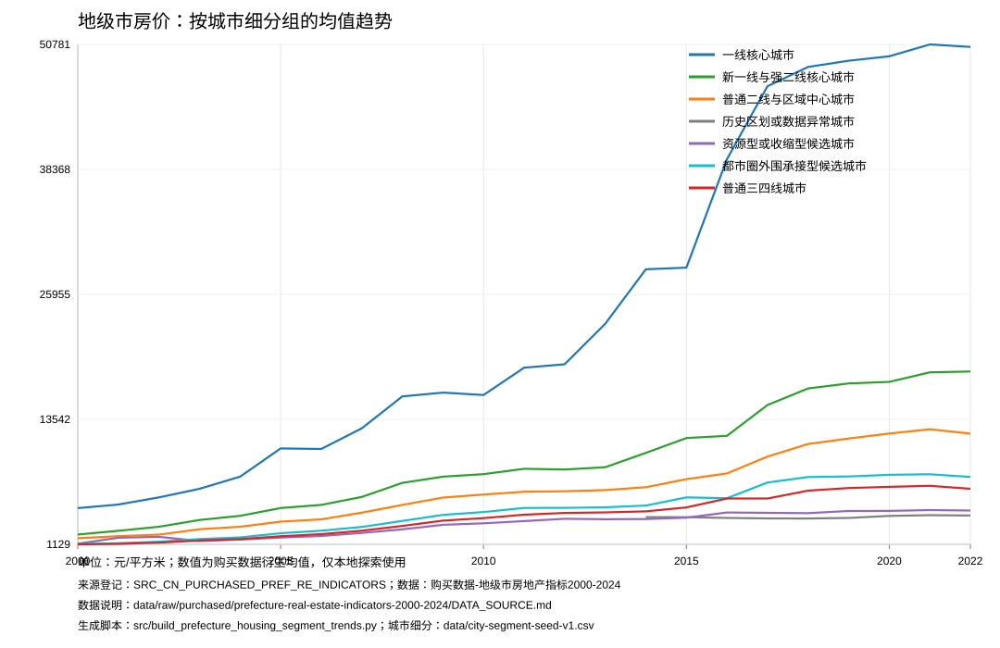
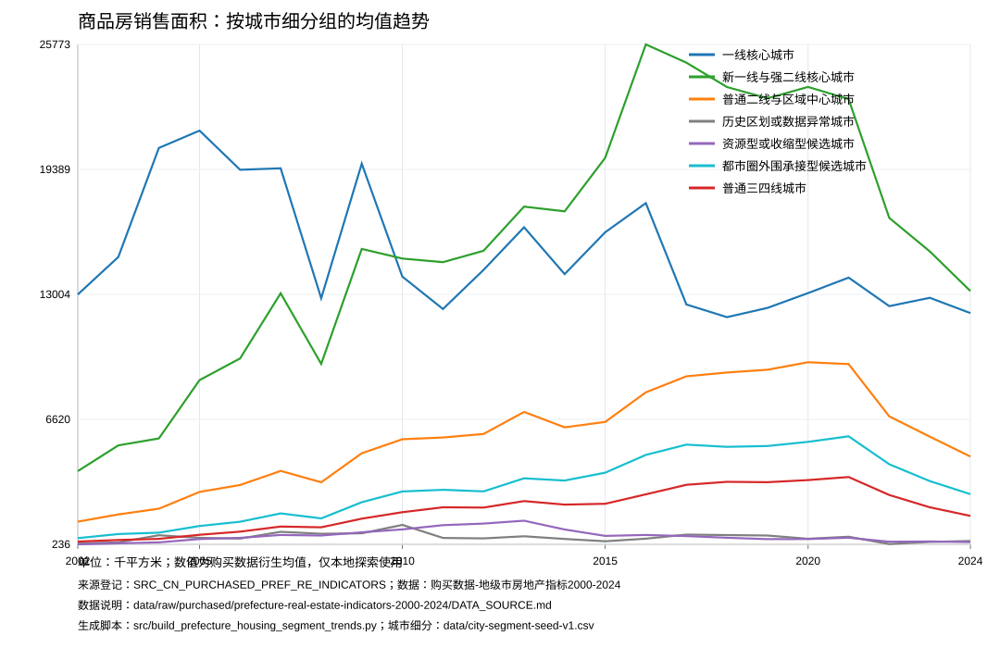
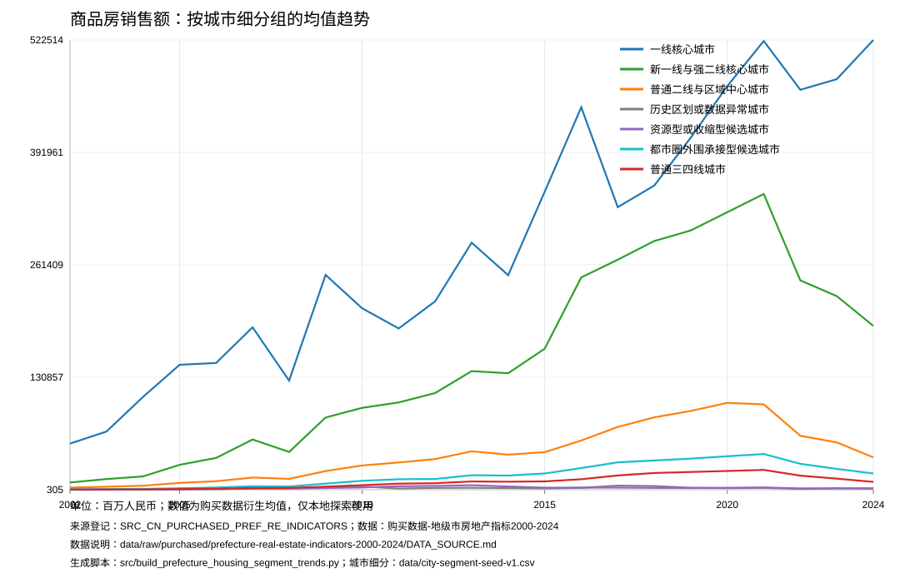
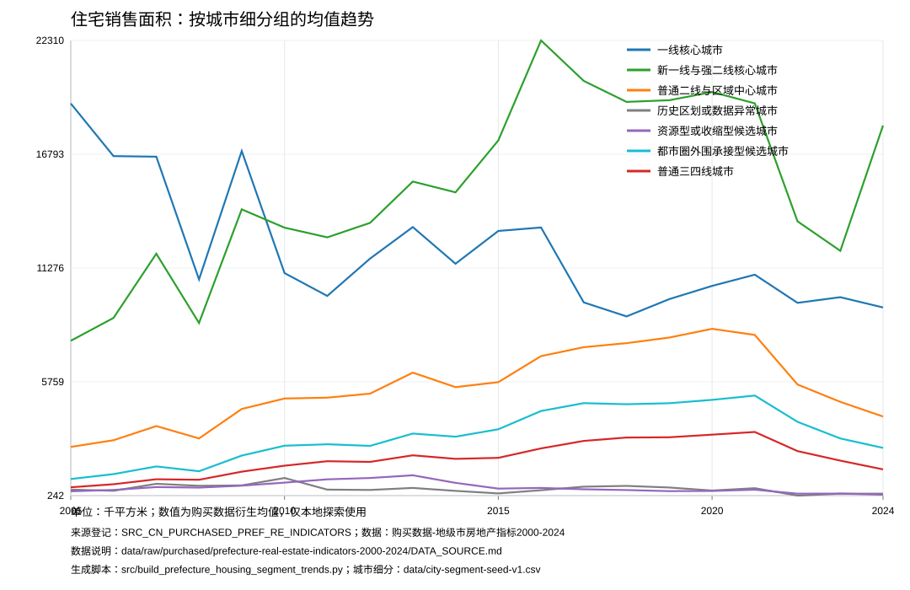
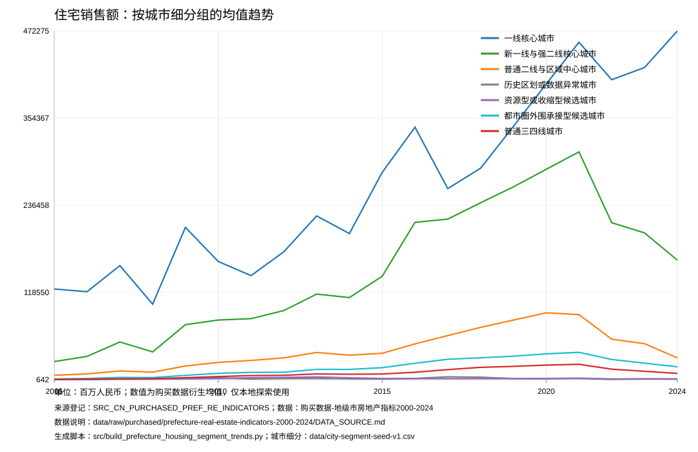
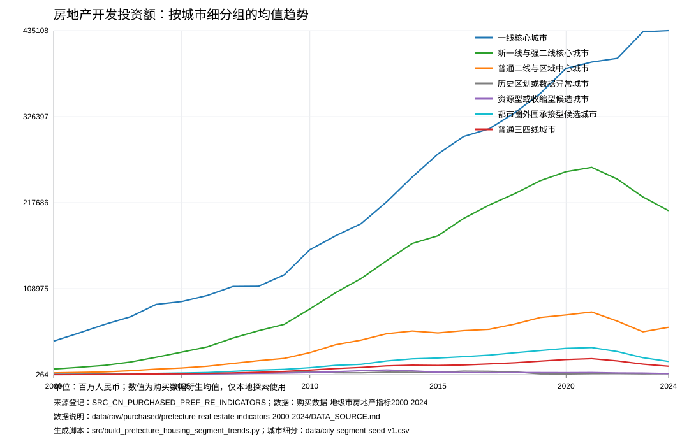
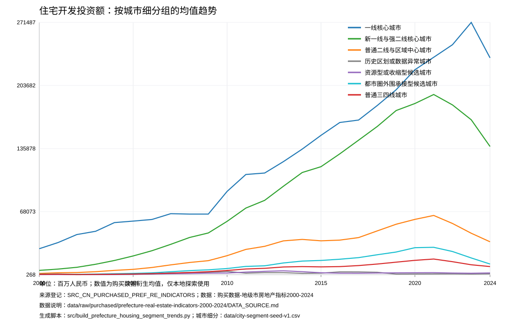

# 地级市房地产指标城市细分趋势观察

本笔记基于本地购买数据生成的城市细分组聚合趋势图。它用于拆解三四线内部差异，尤其比较资源型或收缩型候选城市、都市圈外围承接型候选城市和普通三四线城市；它不是预测结论，也不能替代单城、板块或小区层面的判断。

生成脚本：`src/build_prefecture_housing_segment_trends.py`

本地趋势 CSV：`data/processed/purchased/prefecture-housing-segment-trends.csv`

图表目录：`reports/figures/purchased/prefecture-housing-segment-trends/`

## 图表

### 地级市房价

### 商品房销售面积

### 商品房销售额

### 住宅销售面积

### 住宅销售额

### 房地产开发投资额

### 住宅开发投资额

## Reference

- 数据来源：购买数据-地级市房地产指标 2000-2024，见 `data/raw/purchased/prefecture-real-estate-indicators-2000-2024/DATA_SOURCE.md`。
- 来源登记：`data/source-registry.csv` 中的 `SRC_CN_PURCHASED_PREF_RE_INDICATORS`。
- 生成脚本：`src/build_prefecture_housing_segment_trends.py`。
- 城市细分：`data/city-segment-seed-v1.csv`。
- 峰值回撤摘要：`reports/prefecture-housing-segment-peak-drawdown.md`。

## 初步观察

### 1. 三四线均值掩盖了内部压力差异

把三四线拆开后，资源型或收缩型候选城市在销售面积、销售额和开发投资上的峰值回撤最集中。普通三四线城市同样回撤明显，但峰值通常更靠近 2021 年；资源型或收缩型候选城市的多个指标峰值出现在 2013 年附近，说明它们可能更早进入需求和投资收缩周期。

都市圈外围承接型候选城市的峰值多靠近 2021 年，回撤幅度也大，但这组仍只是人工规则种子。后续需要用通勤、产业迁移、人口流入、轨道交通和租金数据验证，不能把它直接当作已被确认的外溢承接区。

### 2. 成交面积比价格更能暴露压力

房价指标只覆盖到 2022 年，且多数细分组在 2021-2022 年仅出现轻微回落。相比之下，商品房销售面积和住宅销售面积覆盖到 2024 年，多个细分组较峰值回撤超过 40%，更早暴露成交端压力。

这意味着后续判断“是否回暖”时，不能只看价格是否暂时企稳。需要同时观察成交面积、挂牌去化、租金收益率和按揭可得性，否则容易把低成交下的价格黏性误读成真实需求恢复。

### 3. 一线核心城市不是无风险组

一线核心城市的销售额和开发投资在部分 2024 年指标上仍处高位，但样本数量很小，且商品房销售额、住宅销售额等指标 2024 年覆盖率只有 50%。一线核心城市更适合做单城和核心板块核查，不宜只用四城均值推出方向。

同时，一线核心城市住宅销售面积从早期峰值回撤明显。后续应区分核心地段保值、非核心地段流动性下降和高总价资产买方池收缩这三个问题。

### 4. 历史区划或数据异常组只用于排雷

历史区划或数据异常城市在多个指标上覆盖等级为 `poor`，且包含行政区划调整和原始名称异常。该组被单独画出，是为了避免它污染普通三四线均值，不应直接解释为一类可投资城市。

### 5. 低覆盖组合需要降权

住宅销售额、住宅开发投资额在 2024 年有多组末期覆盖率低于 50%。这些组合可以提示风险方向，但不能独立支撑强结论。后续应优先核对 2024 年原始缺失原因，并与统计年鉴、地方统计局、网签或平台成交数据交叉验证。

## 证据限制

- 图表来自购买数据衍生聚合结果，尚未与公开统计年鉴、地方统计局和平台成交数据逐项交叉验证。
- 城市细分来自人工规则种子表，不是最终城市分组。
- 2023-2024 年部分指标覆盖率偏低，尤其是住宅销售额、住宅开发投资额等指标。
- 当前只到城市细分组，不包含同城核心、次核心和非核心地段差异。
- 均值趋势不能替代中位数、分位数、单城趋势和同城板块结构。

## 下一步

- 针对资源型或收缩型候选城市，抽样核对 2013 年前后销售面积、开发投资和人口就业数据。
- 针对都市圈外围承接型候选城市，接入通勤、产业迁移、人口流入和租金数据验证承接属性。
- 对 2024 年覆盖率低于 50% 的组合做原始表回查，标记缺失是数据未披露、口径变化还是真实无记录。
- 接入中国城市数据库 v202603 的人口、就业、工资、财政和产业变量，检查成交回撤是否和基本面同步。
